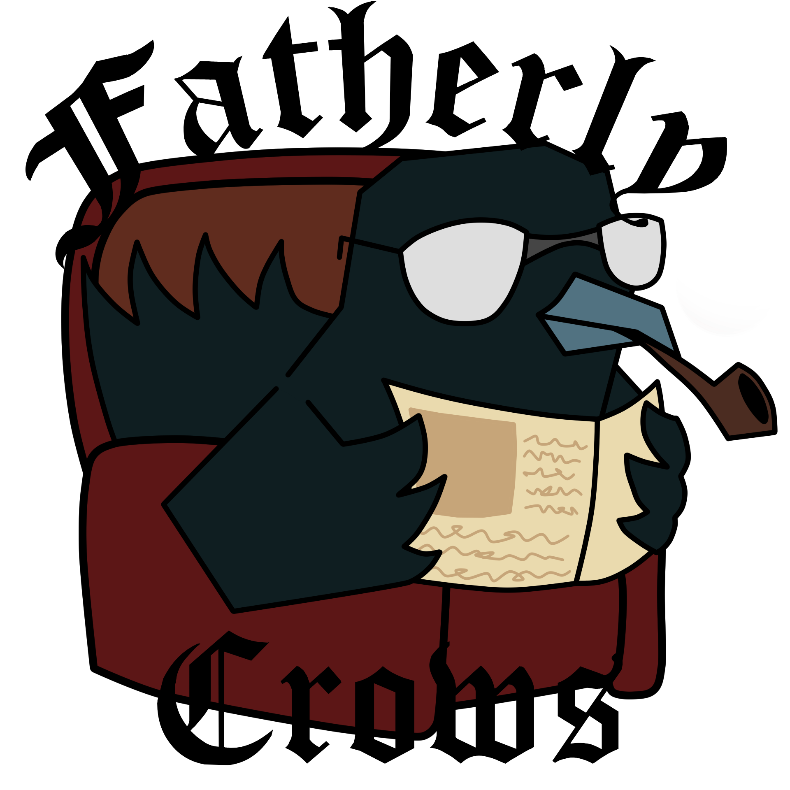

<h1>FATHERLY CROW ENGINE | VERSION 1.0.0 </h1>

## CREDIT FOR LOGO: SPACE_GIRL_AURORA
## THEIR DISCORD: space_girl_aurora

## A LIGHTWEIGHT FRAMEWORK THAT INCLUDES MANY USEFUL COMPONENTS FOR GAME DEVELOPMENT.

* Includes an entity component system
* Includes a gamestate modifier
* Working on a level editor

## LIBRARIES USED

* <a href="https://hump.readthedocs.io/en/latest/gamestate.html">hump.gamestate</a> --> GAMESTATE HANDLING 
* <a href="https://hump.readthedocs.io/en/latest/camera.html">hump.camera</a>    --> CAMERA HANDLING
* <a href="https://github.com/kikito/bump.lua">bump.lua</a>       --> COLLISION HANDLING

